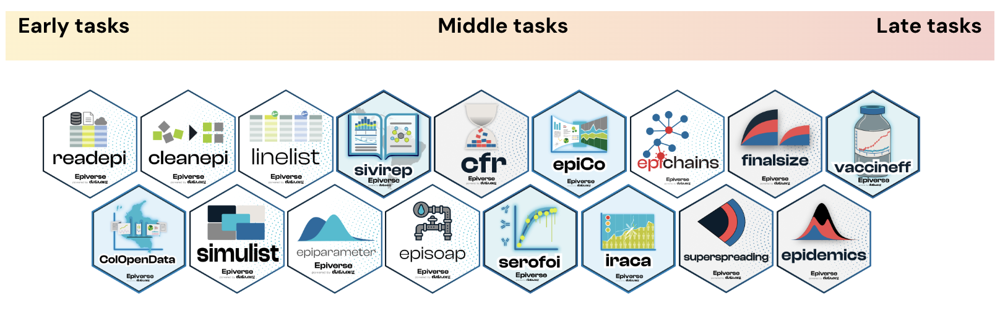
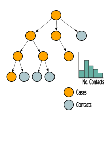

<center>

<h1> Epiverse-TRACE showcase: {simulist} </h1>

<h3> Joshua W. Lambert </h3>

<h3> May 2025 </h3>

</center>

{.absolute top=350 left=800 width="200"}
{.absolute top=300 left=-150 width="500"}

{.absolute top=400 left=400 width="250"}

## Let's take a step back

### Epiverse-TRACE ecosystem of R packages




## Aims of {simulist}

{.absolute top=150 left=850 width="200"}

- {simulist} is an R package for easily simulating individual-level outbreak data
  - Line list data
  - Contact tracing data
  
- Epidemiologically realistic outbreak data

- Highly customisable for users 

- Designed to be used primarily for teaching and methods testing

- Interoperable with epi-ecosystem of R packages

- Compliments [{outbreaks}](https://CRAN.R-project.org/package=outbreaks), which contains empirical outbreak datasets
  
## Features

### Simulation features 

:hourglass_flowing_sand: Parameterised epidemiological delay
distributions

:hospital: Population-wide or age-stratified hospitalisation and death risks 

:bar_chart: Uniform or age-structured populations

:chart_with_upwards_trend: Constant or time-varying case fatality risk

:clipboard: Customisable probability of case types and contact tracing follow-up

### Postprocessing features

:date: Real-time outbreak snapshots with right-truncation

:memo: Messy data with inconsistencies, mistakes and missing values

## Simple package interface {.smaller}

Only 6 functions in the package:

### Simulate

- [`sim_linelist()`](https://epiverse-trace.github.io/simulist/reference/sim_linelist.html)
- [`sim_contacts()`](https://epiverse-trace.github.io/simulist/reference/sim_contacts.html)
- [`sim_outbreak()`](https://epiverse-trace.github.io/simulist/reference/sim_outbreak.html) (i.e. `sim_linelist()` + `sim_contacts()`)

### Post-process

- [`truncate_linelist()`](https://epiverse-trace.github.io/simulist/reference/truncate_linelist.html)
- [`messy_linelist()`](https://epiverse-trace.github.io/simulist/reference/messy_linelist.html)

### Helper function

- [`create_config()`](https://epiverse-trace.github.io/simulist/reference/create_config.html)

::: footer
https://epiverse-trace.github.io/simulist/reference/index.html
:::

## Model schematic slide

#### Network-adjusted contact distribution

{.absolute top=175 right=250 width=800 height=800}

## Getting started

```{r}
#| echo: true
#| code-line-numbers: "2"
set.seed(1)
linelist <- simulist::sim_linelist()
knitr::kable(head(linelist, n = 4))
```

## Getting started

```{r}
#| echo: true
#| code-line-numbers: "2"
set.seed(1)
linelist <- simulist::sim_contacts()
knitr::kable(head(linelist, n = 4))
```

# Demonstration

## Custom epidemiological delay distributions

<br>

```{r}
#| echo: true
#| eval: false
#| code-line-numbers: "2-6"
linelist <- sim_linelist(
  contact_distribution = function(x) dnbinom(x = x, mu = 2, size = 0.5),
  infectious_period = function(x) rgamma(n = x, shape = 2, scale = 2),
  prob_infection = 0.5,
  onset_to_hosp = function(x) rlnorm(n = x, meanlog = 1.5, sdlog = 0.5),
  onset_to_death = function(x) rweibull(n = x, shape = 1, scale = 5)
)
```

## Controlling outbreak size

```{r}
#| echo: true
#| code-line-numbers: "2"
set.seed(1)
linelist <- simulist::sim_linelist(outbreak_size = c(100, 500))
nrow(linelist)
```

<br>

```{r}
#| echo: true
#| warning: true
#| code-line-numbers: "2"
set.seed(12)
linelist <- simulist::sim_linelist(outbreak_size = c(100, 500))
nrow(linelist)
```

<br>

- First element of `outbreak_size` is a _hard_ lower bound. Second element of `outbreak_size` is a _soft_ upper bound.

## Anonymous line list 

:::: {.columns}

::: {.column width="40%"}
```{r}
#| echo: true
#| code-line-numbers: "2"
set.seed(1)
linelist <- simulist::sim_linelist(anonymise = FALSE)
knitr::kable(head(linelist[, c("id", "case_name")]))
```
:::

::: {.column width="5%"}

:::

::: {.column width="40%"}
```{r}
#| echo: true
#| code-line-numbers: "2"
set.seed(1)
linelist <- simulist::sim_linelist(anonymise = TRUE)
knitr::kable(head(linelist[, c("id", "case_name")]))
```
:::

::::

## Case type

:::: {.columns}

::: {.column width="40%"}
```{r}
#| echo: true
#| code-line-numbers: "2"
set.seed(1)
linelist <- simulist::sim_linelist()
knitr::kable(head(linelist[, c("id", "case_type")]))
```
:::

::: {.column width="5%"}

:::

::: {.column width="40%"}
```{r}
#| echo: true
#| code-line-numbers: "2-4"
set.seed(1)
linelist <- simulist::sim_linelist(
  case_type_probs = c(suspected = 0.05, probable = 0.05, confirmed = 0.9)
)
knitr::kable(head(linelist[, c("id", "case_type")]))
```
:::

::::

## Outbreak snapshot with truncation

```{r}
#| echo: true
#| code-line-numbers: "2-4"
set.seed(2)
linelist <- simulist::sim_linelist(
  reporting_delay = function(x) rlnorm(n = x, meanlog = 1, sdlog = 1)
)
knitr::kable(head(linelist[, 1:7], n = 3))
```

#### Aggregate and plot outbreak with {incidence2}

```{r}
#| fig-align: "center"
library(incidence2)
# create <incidence> object
weekly <- incidence(
  x = linelist,
  date_index = "date_onset",
  interval = "epiweek",
  complete_dates = TRUE
)
plot(weekly)
```

## Outbreak snapshot with truncation

```{r}
library(grates)
plot(weekly) +
  ggplot2::geom_vline(xintercept = grates::as_epiweek("2023-02-01"))
```

## Outbreak snapshot with truncation

```{r}
#| echo: true
#| code-line-numbers: "1-4"
trunc_linelist <- simulist::truncate_linelist(
  linelist = linelist, 
  truncation_day = as.Date("2023-02-01")
)
knitr::kable(head(trunc_linelist, n = 4))
```

## Outbreak snapshot with truncation

```{r}
#| fig-align: "center"
library(incidence2)
# create <incidence> object
weekly <- incidence(
  x = trunc_linelist,
  date_index = "date_onset",
  interval = "epiweek",
  complete_dates = TRUE
)
plot(weekly)
```

## Advanced features

- [Age-stratified hospitalisation and death risk](https://epiverse-trace.github.io/simulist/articles/age-strat-risks.html).

<br>

- [Age-structured populations](https://epiverse-trace.github.io/simulist/articles/age-struct-pop.html)

<br>

- [Time-varying case fatality risk](https://epiverse-trace.github.io/simulist/articles/time-varying-cfr.html)

<br>

- [Reporting delays and right truncation](https://epiverse-trace.github.io/simulist/articles/reporting-delays-truncation.html)

::: footer
https://epiverse-trace.github.io/simulist/articles/
:::

# Interoperability

## {simulist} and complimentary R packages

<center>

<br>

:package: :left_right_arrow: :package: [{epiparameter}](https://epiverse-trace.github.io/epiparameter/) 

<br>

:package: :left_right_arrow: :package: [{epicontacts}](https://www.repidemicsconsortium.org/epicontacts/)

<br>

:package: :left_right_arrow: :package: [{incidence2}](https://www.reconverse.org/incidence2/)

<br>

:package: :left_right_arrow: :package: [{cleanepi}](https://epiverse-trace.github.io/cleanepi/)

</center>

## {simulist} & {epiparameter}

```{r}
#| echo: true
library(epiparameter)
# create <epiparameter> for infectious period
infectious_period <- epiparameter(
  disease = "COVID-19",
  epi_name = "infectious period",
  prob_distribution = create_prob_distribution(
    prob_distribution = "gamma",
    prob_distribution_params = c(shape = 1, scale = 1)
  )
)

# get onset to death from {epiparameter} database
onset_to_death <- epiparameter_db(
  disease = "COVID-19",
  epi_name = "onset to death",
  single_epiparameter = TRUE
)

linelist <- simulist::sim_linelist(
  infectious_period = infectious_period,
  onset_to_death = onset_to_death
)
```

## {simulist} & {incidence2}

```{r}
#| echo: true
#| fig-align: "center"
library(incidence2)
set.seed(1)
linelist <- simulist::sim_linelist()
daily <- incidence(
  x = linelist,
  date_index = "date_onset",
  interval = "daily",
  complete_dates = TRUE
)
plot(daily)
```

## {simulist} & {incidence2}

```{r}
#| echo: true
#| code-fold: true
#| code-summary: "Show the code"
library(incidence2)
library(tidyr)
library(dplyr)
set.seed(1)
linelist <- simulist::sim_linelist()

linelist <- linelist %>%
  tidyr::pivot_wider(
    names_from = outcome,
    values_from = date_outcome
  ) %>%
  dplyr::rename(
    date_death = died,
    date_recovery = recovered
  )

daily <- incidence(
  linelist,
  date_index = c(
    onset = "date_onset",
    hospitalisation = "date_admission",
    death = "date_death"
  ),
  interval = "daily",
  complete_dates = TRUE
)
plot(daily)
```

## {simulist} & {epicontacts}

```{r}
#| echo: true
#| output-location: column
library(epicontacts)
set.seed(2)
outbreak <- simulist::sim_outbreak()
epicontacts <- make_epicontacts(
  linelist = outbreak$linelist,
  contacts = outbreak$contacts,
  id = "case_name",
  from = "from",
  to = "to",
  directed = TRUE
)
plot(epicontacts)
```

## {simulist} & {cleanepi}

### Create a _messy_ linelist 

```{r}
#| echo: true
#| code-line-numbers: "3"
set.seed(1)
linelist <- simulist::sim_linelist()
messy_linelist <- simulist::messy_linelist(linelist)
knitr::kable(head(messy_linelist, n = 4))
```

::: footer
See `?messy_linelist` for changing messyness options
:::

## {simulist} & {cleanepi}

```{r}
#| echo: true
#| code-line-numbers: "1-3"
clean_linelist <- messy_linelist |> 
  cleanepi::convert_to_numeric(target_columns = c("id", "age")) |>
  cleanepi::remove_duplicates()
knitr::kable(head(clean_linelist, n = 5))
```

## {simulist} & {cleanepi}

```{css}
.center h2 {
  text-align: center;
}
```

<br> 
<br>

<h2> <center> More on this in Karim's talk </center> <h2> 

## Thank you for listening {.center}

<h2> <center>  Any questions? </center> </h2>

- Please provide feature requests or bug reports as [issues on GitHub](https://github.com/epiverse-trace/simulist/issues).

- [Contributions](https://github.com/epiverse-trace/.github/blob/main/CONTRIBUTING.md) welcomed.


